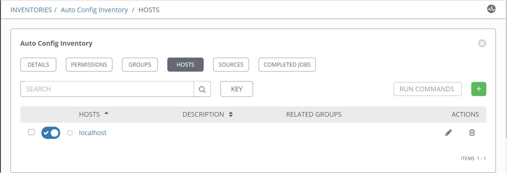
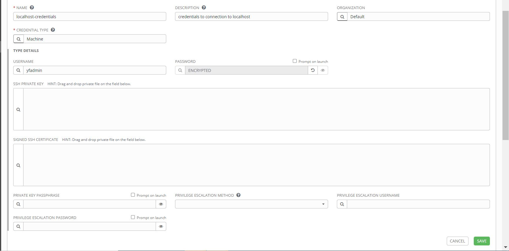
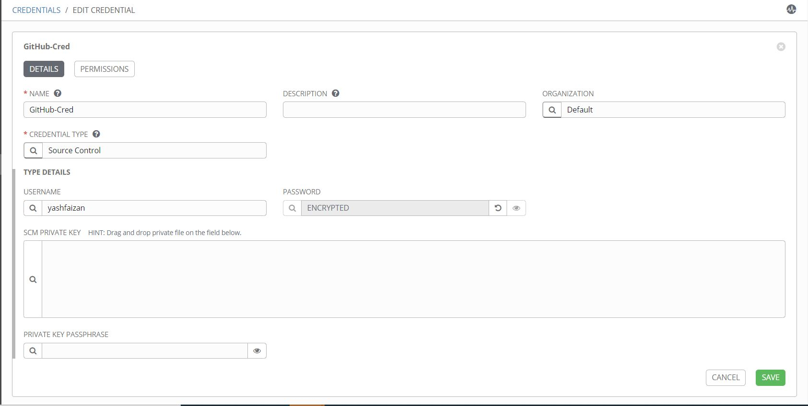
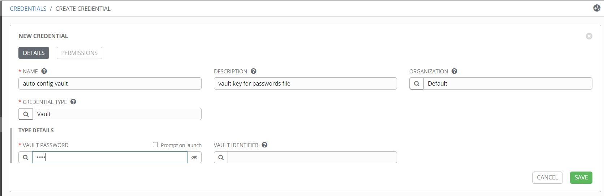
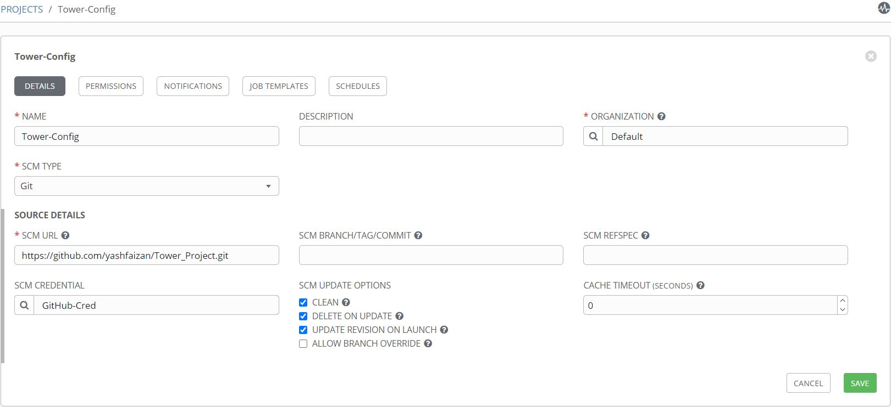
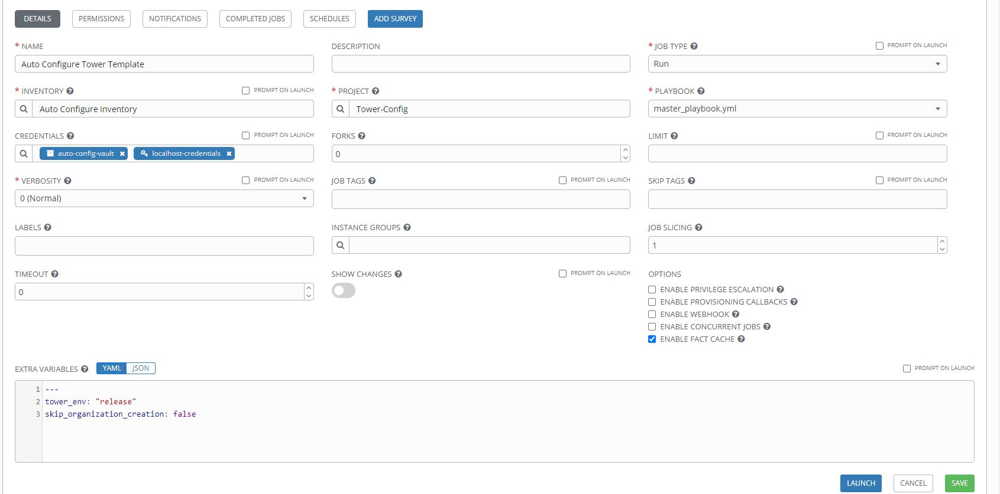

# Ansible Tower Auto Config

This project auto configures the custom credentials, inventories, credentials, projects, templates and workflows in ansible tower by utilizing ansible tower modules and tower-cli commands.

All the configurations required for this project should be stored in a **JSON** files. These confguration files are stored in a seperate respository called **ansible-tower-config-configuration-files**

The project creates a new organization and all the configurations/tasks mentioned in the **JSON** file would be a part of newly created organization. If any of the configuration already exists then the playbook updates/adds additional data given in **JSON** file.


## Prerequisites

- [Tower-cli](https://pypi.org/project/ansible-tower-cli/)>= 3.3.7 must be installed on the server hosting ansible tower. For AWX Environment this package must be installed on **awx_task** container
- User account with admin privileges


## Ansible Tower Setup

The below configurations should be setup in the ansible tower for the project up and running.

1. Inventory
2. Credentials [ Machine, Source Control, Vault ]
3. Project
4. Template

```
For Prod environment we would highly recommend to encrypt the passwords file using ansible vault.
```

```
For Test Environment you can make use of the passwords example file. In this case you can skip the vault credential setup.
```

### Inventory Setup

Create an inventory and in the hosts section add **localhost** as the hostname.




### Credentials Setup

##### Machine Credentials

```
This credential is used by the playbook to connect to localhost.
```

|             Field                |           Description             |            value               |
| -------------------------------- | --------------------------------- | ------------------------------ |
|             Name                 |       Name of the credentials     |    Localhost-Credentails  |
|         Credential Type          |       Type of Credentials         |           Machine              |
|            Username              |       Username of the local host |           TestUser             |
|            Password              |       Password of the local host |         TestPassword@123       |



##### SCM Credentials

```
This credentials are used with Projects to clone and update local source code repositories from a remote revision control system such as GitHub, Bitbucket, GitLab or Subversion.
```

|             Field                |           Description             |            value               |
| -------------------------------- | --------------------------------- | ------------------------------ |
|             Name                 |       Name of the credentials     |    BBC-BitBucket-Creds         |
|         Credential Type          |       Type of Credentials         |        Source Control          |
|            Username              |       Username of source control  |         BBC-SCM-User           |
|            Password              |       Password of source control  |         Password@123           |



##### Vault Credentials

```
Since passwords are encrypted using ansible vault, vault credential is required in order to decrypt those passwords.

```
|             Field                |           Description             |            value               |
| -------------------------------- | --------------------------------- | ------------------------------ |
|             Name                 |       Name of the credentials     |    BBC-Vault-Creds         |
|         Credential Type          |       Type of Credentials         |        Vault                   |
|           Vault Password         |       Password used while encrypting the vault file  |     VaultPass@123           |




### Project Setup

```
Projects are a logical collection of playbooks in ansible tower. We have to configure and sync the project.
Below is an example table.
```

|             Field                |           Description             |            value               |
| -------------------------------- | --------------------------------- | ------------------------------ |
|             Name                 |       Name of the Project     |    Tower-Auto-Config         |
|         SCM Type          |       Type of Source Control being used         |        Git         |
|            SCM URL             |       URL of the repository  |     https://github.com/yashfaizan/tower-auto-config.git           |
|            SCM branch              |      Name of the branch  |         master           |
|            SCM Credential              |      Credential used to authenticate the repository  |         scm-test-creds        |



### Job Templates Setup

```
Job Templates are combination of an Ansible playbook and the set of parameters required to execute a particular task on the target server.
Below table gives an example of job template configuration details
```
|             Field                |           Description             |            value               |
| -------------------------------- | --------------------------------- | ------------------------------ |
|             Name                 |       Name of the Template     |    Tower-Auto-Config-Template        |
|         Job Type          |       Type of Job         |        Run          |
|            Inventory              |       Name of Inventory   |         Demo Inventory           |
|            Project             |       Project containing the playbook to be executed  |     Tower-Auto-Config-Template           |
|           Playbook               |       Name of the Playbook     |    master_playbook.yml        |
|           Credentials               |     Credentails to be used by the playbook    |   Linux-Server-Credentails,Ansible-Tower-Creds, BBC-Vault-Creds    |
|           Extra Vars               |     Extra Variables passed to the playbook     |   skip_organization_creation: true/false    |



### Tower Environment Variables Setup

```
Below variables needs to be set in the Ansible/AWX Tower
1. tower_env: release/national (or any other environment the tower is set up)
2. tower_gui_url: http(s)://10.0.0.1 (tower url)

This variable can be set by logging into tower-->settings-->jobs-->extra environment varibales
```

## Setup of **JSON** files

### Naming Conventions of **JSON** files

This project depends on 2 **JSON** files
- config_ansible_tower_vars_['tower environment'].json
- passwords_file_vault_['tower environment'].json


If the tower environment is **test** then the naming convention of both the files should be
- config_ansible_tower_vars_test.json
- passwords_file_vault_test.json


If the tower environment is **dev** then the naming convention of both the files should be
- config_ansible_tower_vars_dev.json
- passwords_file_vault_dev.json

### Configuration of **JSON** files

For reference the project contains example files on how the json data should look like. Take a look at **config_ansible_tower_vars_example.json** and **passwords_file_vault_example.json**

# Run

Once all the setup is completed , trigger the job template to auto configure the ansible tower with the configurations stored in **JSON** file.

# Roles

This repository makes use of roles for executing appropriate tasks.Click on appropriate role name for detailed description.

| Role Name | Brief description |
|-----------|-------------------|
|[role_ansible_clone_git_repo](role_ansible_clone_git_repo/README.md) | This role clones a repository to specified path |
|[role_ansible_create_configurations](role_ansible_create_configurations/README.md) | This role creates configurations |
|[role_ansible_pre_check](role_ansible_pre_check/README.md) | This role pre checks for a configurations |
|[role_ansible_tower_add_hosts](role_ansible_tower_add_hosts/README.md) | This role add hosts to a particular inventory |
|[role_ansible_tower_create_credentials](role_ansible_tower_create_credentials/README.md) | This role creates credentials based on data defined in the credentials section of master json file |
|[role_ansible_tower_create_custom_credentials](role_ansible_tower_create_custom_credentials/README.md) | This role creates custom credentials |
|[role_ansible_tower_create_inventory](role_ansible_tower_create_inventory/README.md) | This role creates inventory based on data defined in the inventory section of master json file |
|[role_ansible_tower_create_projects](role_ansible_tower_create_projects/README.md) | This role creates projects based on data defined in the projects section of master json file |
|[role_ansible_tower_create_templates](role_ansible_tower_create_templates/README.md) | This role creates templates based on data defined in the templates section of master json file |
|[role_ansible_tower_create_workflows](role_ansible_tower_create_workflows/README.md) | This role creates workflow templates based on schema defined in the master json file |
|[role_ansible_tower_delete_configuration](role_ansible_tower_delete_configuration/README.md) | This role delete a configuration |
|[role_ansible_update_configurations](role_ansible_update_configurations/README.md) | This role updates configurations |